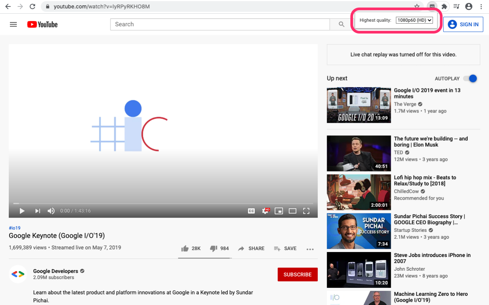
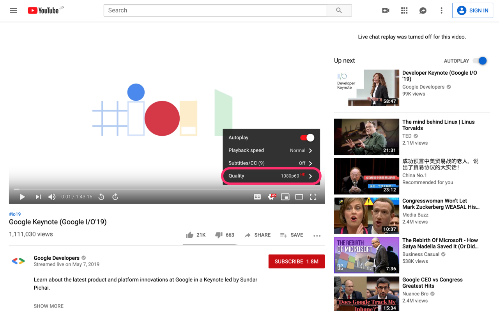

# Video Quality Fixer for YouTube

[](https://github.com/fiahfy/youtube-video-quality-fixer/actions/workflows/create-release.yml)

> Chrome extension that fixes the video quality to the highest available on YouTube.

## Features

- Fix highest available video quality at first.
- Set highest video quality.

## Screenshots




## Installation

1. Download `dist.zip` from [releases page](https://github.com/fiahfy/youtube-video-quality-fixer/releases) and unzip this file.
2. Open the Extension Management page by navigating to `chrome://extensions`.
3. Enable Developer Mode by clicking the toggle switch next to **Developer mode**.
4. Click the **LOAD UNPACKED** button and select the unpacked directory named `dist`.

## Development

```bash
# install dependencies
yarn

# watch files changed and reload extension
yarn dev
```
